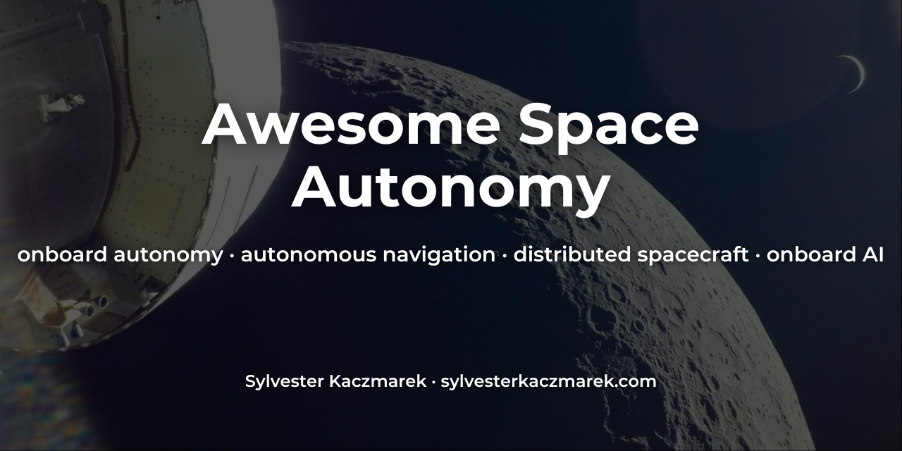

# Awesome Space Autonomy [](https://awesome.re)



A curated list of research, flight demonstrations, software, tools, benchmarks, and engineering guidance for spacecraft and space robots that can sense, decide, plan, navigate, recover, and cooperate with reduced dependence on Earth.

The focus is operational autonomy in the space segment: onboard decision-making, planning and execution, autonomous navigation and GNC, fault management, onboard AI and science, distributed spacecraft, and robotic exploration. General astrodynamics, ground systems, and space software are included only when they directly enable autonomy development or assurance.

Maintained by [Sylvester Kaczmarek](https://github.com/sylvesterkaczmarek).

> **Curation rule:** inclusion means the resource is useful enough to recommend, not merely space-related. Prefer primary sources, flight-validated systems, maintained software, reproducible research, and resources with clear autonomy value.

## Contents

- [Flight heritage and current demonstrations](#flight-heritage-and-current-demonstrations)
- [Flight software and autonomy frameworks](#flight-software-and-autonomy-frameworks)
- [Planning, scheduling, and execution](#planning-scheduling-and-execution)
- [Autonomous navigation, GNC, rendezvous, and landing](#autonomous-navigation-gnc-rendezvous-and-landing)
- [Fault management, FDIR, and health management](#fault-management-fdir-and-health-management)
- [Onboard AI and autonomous science](#onboard-ai-and-autonomous-science)
- [Distributed autonomy, swarms, and formation flying](#distributed-autonomy-swarms-and-formation-flying)
- [Space robotics and surface autonomy](#space-robotics-and-surface-autonomy)
- [Simulation, verification, test, and benchmarks](#simulation-verification-test-and-benchmarks)
- [Standards and engineering guidance](#standards-and-engineering-guidance)
- [Related collections](#related-collections)
- [Cite this list](#cite-this-list)

## Flight heritage and current demonstrations

- [Deep Space 1 Remote Agent](https://www.jpl.nasa.gov/nmp/ds1/tech/autora.html) - First flight demonstration of onboard AI planning, execution, and fault recovery for a deep-space spacecraft.
- [Deep Space 1 AutoNav](https://www.jpl.nasa.gov/nmp/ds1/tech/autonav.html) - Pioneering autonomous optical navigation that let a spacecraft estimate its trajectory and command its own maneuvers.
- [Autonomous Sciencecraft Experiment on EO-1](https://www.jpl.nasa.gov/missions/autonomous-sciencecraft-experiment-ase/) - Flight demonstration of onboard science analysis, planning, and retasking for Earth observation.
- [Proba-1](https://www.esa.int/Applications/Observing_the_Earth/Proba-1_overview) - ESA's Project for On-Board Autonomy, demonstrating autonomous GNC, onboard scheduling, payload and resource management, and reduced dependence on ground operations since 2001.
- [AEGIS](https://ai.jpl.nasa.gov/public/projects/aegis/) - Flight-proven autonomous target selection for Mars rovers, enabling onboard prioritization of scientifically useful observations.
- [Mars 2020 Terrain-Relative Navigation](https://www-robotics.jpl.nasa.gov/what-we-do/flight-projects/mars-2020-rover/terrain-relative-navigation/) - Flight-proven vision-based localization and hazard-aware landing-site selection used by Perseverance.
- [DART SMART Nav](https://www.nasa.gov/solar-system/smart-nav-giving-spacecraft-the-power-to-guide-themselves/) - Autonomous terminal guidance that identified Dimorphos and steered DART to impact without ground intervention.
- [CAPSTONE](https://www.nasa.gov/mission/capstone/) - Cislunar technology demonstration that validated autonomous navigation using peer-to-peer ranging with NASA's Lunar Reconnaissance Orbiter.
- [Proba-3](https://www.esa.int/Enabling_Support/Space_Engineering_Technology/Proba-3) - ESA formation-flying mission demonstrating autonomous millimetre-class relative positioning between two spacecraft.
- [Hera](https://www.esa.int/Space_Safety/Hera) - ESA planetary-defense mission designed to use autonomous navigation for close operations around the Didymos binary asteroid system.
- [SLIM](https://global.jaxa.jp/projects/sas/slim/) - JAXA precision lunar-landing mission demonstrating image-based navigation, autonomous hazard response, and pinpoint landing technologies.
- [Hayabusa autonomous navigation](https://global.jaxa.jp/article/special/hayabusa/sawai_e.html) - JAXA account of target-marker-based autonomous navigation and landing operations at asteroid Itokawa.
- [SpaDeX](https://www.isro.gov.in/mission_SpaDeX.html) - ISRO technology demonstrator for autonomous rendezvous, docking, and formation operations between small spacecraft.
- [Starling](https://www.nasa.gov/mission/starling/) - NASA CubeSat swarm mission demonstrating autonomous navigation, coordination, and distributed decision-making.
- [OPS-SAT](https://esoc.esa.int/content/ops-sat) - ESA in-orbit experimentation platform used to validate onboard AI, autonomy, and advanced operations concepts.
- [Φsat-1](https://www.esa.int/Applications/Observing_the_Earth/Ph-sat/Artificial_Intelligence_for_Earth_observation) - First AI carried on a European Earth-observation mission, filtering cloud-covered imagery onboard before downlink.
- [Φsat-2](https://www.esa.int/Applications/Observing_the_Earth/Phsat-2) - ESA Earth-observation mission running multiple AI applications onboard to filter, analyze, and prioritize imagery.
- [ASTERIA extended mission](https://www.jpl.nasa.gov/missions/arcsecond-space-telescope-enabling-research-in-astrophysics-extended/) - CubeSat mission that flight-tested autonomous optical navigation and onboard planning and execution, while maturing model-based fault diagnosis in its ground testbed.

## Flight software and autonomy frameworks

- [F Prime](https://github.com/nasa/fprime) - Flight-proven component-based framework for embedded and spacecraft software, including autonomous mission applications.
- [NASA Core Flight System](https://github.com/nasa/cFS) - Reusable flight-software framework and application ecosystem used across NASA spacecraft and instruments.
- [Space ROS](https://github.com/space-ros/space-ros) - ROS 2-based space robotics framework focused on flight-relevant software, testing, and interoperability.
- [Astrobee Robot Software](https://github.com/nasa/astrobee) - Flight software for NASA's free-flying ISS robots, including localization, navigation, docking, and autonomous behaviors.
- [ISAAC](https://github.com/nasa/isaac) - NASA autonomy stack for robotic and facility caretaking built around Astrobee, inspection, planning, and anomaly workflows.
- [SYNOPSIS](https://github.com/NASA-AMMOS/synopsis) - Open-source onboard data-product generation and prioritization framework for autonomous science operations.
- [cFS Stored Commands](https://github.com/nasa/SC) - cFS application for time-tagged and event-driven onboard command sequences used in autonomous execution.

## Planning, scheduling, and execution

- [ASPEN](https://ai.jpl.nasa.gov/public/projects/aspen/) - JPL planning and scheduling system used for spacecraft, rovers, instruments, and mission operations.
- [CASPER](https://ai.jpl.nasa.gov/public/projects/casper/) - Continuous planning, scheduling, execution, and replanning framework derived from ASPEN.
- [PLEXIL](https://ntrs.nasa.gov/citations/20060019246) - NASA plan-execution language and executive designed for deterministic command and control of autonomous systems.
- [MEXEC](https://ai.jpl.nasa.gov/public/projects/mexec/) - Lightweight multi-mission onboard planning, scheduling, and execution system developed at JPL.
- [Aerie](https://ai.jpl.nasa.gov/public/projects/aerie/) - Open mission-planning environment from JPL with simulation and scheduling capabilities for complex spacecraft operations.
- [CLASP](https://ai.jpl.nasa.gov/public/projects/clasp/) - Long-range scheduler for observation planning under operational, geometric, and resource constraints.
- [Operations for Increasingly Autonomous Spacecraft](https://ai.jpl.nasa.gov/public/projects/ops-for-autonomy/) - Research on mission-operations planning concepts needed as spacecraft assume more onboard decision authority.
- [Europa Lander autonomy prototype](https://ai.jpl.nasa.gov/public/projects/europa-lander/) - Prototype autonomy architecture using onboard execution and replanning for a communication-constrained surface mission.
- [Orbital Express automated planning](https://ai.jpl.nasa.gov/public/projects/orbital-express/) - JPL application of automated planning to autonomous rendezvous, servicing, and mission operations.

## Autonomous navigation, GNC, rendezvous, and landing

- [Autonomous Landing and Hazard Avoidance Technology](https://www.nasa.gov/space-technology-mission-directorate/tdm/autonomous-landing-hazard-avoidance-technology-alhat/) - NASA integrated sensing and GNC program for autonomous precision landing and real-time hazard avoidance.
- [JPL Landing autonomy research](https://robotics.jpl.nasa.gov/what-we-do/applications/landing/) - JPL research on terrain-relative navigation, hazard detection and avoidance, and pinpoint planetary landing.
- [Raven](https://www.nasa.gov/isam/raven/) - ISS technology demonstration of autonomous relative navigation using visible, infrared, lidar, and onboard pose estimation.
- [NASA Relative Navigation System](https://www.nasa.gov/isam/relative-navigation-system/) - Autonomous real-time relative-navigation architecture for rendezvous and proximity operations with client spacecraft.
- [OSIRIS-REx Natural Feature Tracking](https://www.nasa.gov/missions/bennus-boulders-shine-as-beacons-for-nasas-osiris-rex/) - Flight-proven optical navigation that matched onboard imagery to asteroid landmarks and supported autonomous hazard-aware targeting during sample collection at Bennu.
- [Hera self-driving navigation](https://www.esa.int/Space_Safety/Hera/Hera_asteroid_mission_tested_self-driving_technique_at_Mars) - In-flight test of autonomous feature tracking and optical navigation later used for asteroid proximity operations.
- [Perseverance autonomous mobility](https://www-robotics.jpl.nasa.gov/what-we-do/flight-projects/mars-2020-rover/m2020mobility/) - Mars 2020 mobility system combining visual odometry, hazard assessment, and autonomous route execution.
- [Hayabusa2 navigation instruments](https://global.jaxa.jp/projects/sas/hayabusa2/instruments.html) - JAXA navigation and target-marker systems supporting autonomous asteroid approach, descent, and sampling.
- [SpaDeX second autonomous docking](https://www.isro.gov.in/Spadex_Successful_demonstration_of_Second_Docking_and_Power_Transfer.html) - ISRO demonstration of fully autonomous docking from close range and subsequent power transfer.
- [SROC](https://www.esa.int/Enabling_Support/Space_Engineering_Technology/Technology_CubeSats/SROC) - ESA CubeSat mission planned to demonstrate autonomous rendezvous and docking with Space Rider.

## Fault management, FDIR, and health management

- [Fault Management Guiding Principles](https://ntrs.nasa.gov/citations/20120008006) - NASA principles for engineering spacecraft fault-management functions across the mission lifecycle.
- [Fault Management Design Strategies](https://ntrs.nasa.gov/citations/20160008180) - Structured framework for selecting and implementing fault-management strategies in dependable space systems.
- [Fault Management Practice Roadmap](https://ntrs.nasa.gov/citations/20150009161) - NASA analysis of architecture, testing, and lifecycle problems in autonomous spacecraft fault management.
- [Fault Management Architectures and Software Assurance](https://ntrs.nasa.gov/citations/20150005781) - NASA work connecting spacecraft fault-management architecture choices with software-assurance challenges.
- [cFS Health and Safety](https://github.com/nasa/HS) - cFS application for application monitoring, event response, watchdog behavior, and processor reset management.
- [cFS Limit Checker](https://github.com/nasa/LC) - cFS application that evaluates telemetry limits and can trigger onboard command responses to violations.
- [ASTERIA autonomy experiments](https://ai.jpl.nasa.gov/public/projects/asteria/) - JPL work combining flight-tested MEXEC planning and execution with testbed-based model-driven fault diagnosis for more robust spacecraft operations.

## Onboard AI and autonomous science

- [Autonomous Sciencecraft Experiment](https://ai.jpl.nasa.gov/public/projects/ase/) - JPL autonomy system combining onboard science analysis, planning, execution, and event-driven retasking.
- [Agile Science](https://ai.jpl.nasa.gov/public/projects/agile-science/) - JPL research on autonomous science systems that detect events and adapt observations onboard.
- [SYNOPSIS autonomy technology](https://ml.jpl.nasa.gov/autonomies/synopsis.html) - JPL overview of onboard summarization, product generation, and prioritization for bandwidth-constrained missions.
- [Φsat-2 science phase](https://www.esa.int/Applications/Observing_the_Earth/Phsat-2/Phsat-2_begins_science_phase_for_AI_Earth_images) - Operational example of onboard AI applications processing Earth-observation imagery before downlink.
- [JPL Machine Learning and Instrument Autonomy products](https://ml.jpl.nasa.gov/products.html) - Collection of reusable JPL onboard machine-learning and instrument-autonomy capabilities.
- [AEGIS on Mars](https://www.jpl.nasa.gov/news/nasa-mars-rover-can-choose-laser-targets-on-its-own/) - Flight example of onboard AI autonomously selecting scientific targets for Curiosity's ChemCam.

## Distributed autonomy, swarms, and formation flying

- [Distributed Spacecraft Autonomy](https://www.nasa.gov/game-changing-development-projects/distributed-spacecraft-autonomy-dsa/) - NASA project developing collaborative decision-making and resource sharing across multiple spacecraft.
- [What is NASA's Distributed Spacecraft Autonomy?](https://www.nasa.gov/centers-and-facilities/ames/what-is-nasas-distributed-spacecraft-autonomy/) - NASA overview of decentralized coordination for spacecraft teams operating with limited ground contact.
- [MuSCAT](https://github.com/nasa/muscat) - NASA multi-spacecraft autonomy testbed for algorithms involving distributed spacecraft and constellation behaviors.
- [CADRE](https://www.jpl.nasa.gov/missions/cadre/) - JPL lunar technology demonstration for a team of small rovers that coordinate tasks with limited Earth supervision.
- [CADRE autonomy](https://ai.jpl.nasa.gov/public/projects/cadre/) - JPL autonomy architecture for distributed task planning, coordination, and execution across a rover team.
- [LEV-1](https://global.jaxa.jp/press/2024/01/20240125-2_e.html) - JAXA lunar robot demonstration involving autonomous movement, direct-to-Earth communication, and coordinated surface operations.
- [LEV-2](https://global.jaxa.jp/press/2024/01/20240125-4_e.html) - Transformable lunar robot that autonomously moved and imaged SLIM after deployment on the Moon.

## Space robotics and surface autonomy

- [Space Robotics Bench](https://github.com/AndrejOrsula/space_robotics_bench) - Simulation benchmark for robot learning and autonomy in orbital and planetary robotics scenarios.
- [NASA Astrobee](https://www.nasa.gov/astrobee/) - ISS free-flying robotic system for autonomous navigation, inspection, manipulation, and guest-science experiments.
- [Ingenuity autonomous flight control](https://science.nasa.gov/blog/what-were-learning-about-ingenuitys-flight-control-and-aerodynamic-performance/) - NASA account of the onboard estimation and flight-control algorithms that let the Mars helicopter execute flights autonomously after receiving high-level instructions from Earth.
- [ISAAC project results](https://ntrs.nasa.gov/citations/20250003945) - NASA results from autonomous spacecraft-caretaking technology demonstrated in simulation, ground testing, and ISS Astrobee activities.
- [CADRE cooperative rovers](https://www.nasa.gov/missions/tech-demonstration/cadre/) - Mission architecture for multiple autonomous lunar rovers cooperating without continuous ground control.
- [NASA advanced rover autonomy testing](https://www.nasa.gov/solar-system/moon/nasa-testing-advanced-capabilities-for-moon-mars-rovers/) - 2026 testing of autonomy technologies for rover navigation and science in steep, difficult planetary terrain.
- [NeBula Autonomy Suite](https://robotics.jpl.nasa.gov/how-we-do-it/systems/nebula-autonomy-suite/) - JPL multi-robot autonomy software for resilient navigation, mapping, risk-aware decisions, and exploration under uncertainty.

## Simulation, verification, test, and benchmarks

- [NASA Operational Simulator for Space Systems](https://github.com/nasa/nos3) - Open-source spacecraft simulation, integration, test, training, and V&V environment.
- [Basilisk](https://github.com/AVSLab/basilisk) - Spacecraft simulation framework for flight algorithms, dynamics, navigation, guidance, and control research.
- [BSK-RL](https://github.com/AVSLab/bsk_rl) - Reinforcement-learning environments built on Basilisk for autonomous spacecraft decision-making research.
- [42](https://github.com/ericstoneking/42) - Open-source spacecraft attitude, orbit, sensor, actuator, and multi-body simulation environment.
- [Trick](https://github.com/nasa/trick) - NASA simulation framework used to build high-fidelity real-time and faster-than-real-time engineering simulations.
- [JEOD](https://github.com/nasa/jeod) - NASA dynamics models for spacecraft trajectory, environment, and rigid-body simulation.
- [GMAT](https://github.com/nasa/GMAT) - NASA mission-design and trajectory-analysis system useful for validating autonomous navigation and maneuver concepts.
- [PLEXIL-V](https://github.com/nasa/PLEXIL-V) - Verification-oriented PLEXIL environment for analysis of autonomous plans and execution behavior.
- [Ogma](https://github.com/nasa/ogma) - NASA tool for generating runtime monitors and integration code for cFS, F Prime, and ROS-based flight and robotics applications.
- [Stanford spacecraft vision datasets](https://slab.stanford.edu/projects/datasets) - SPEED, SPEED+, and SHIRT datasets for machine-learning-based noncooperative spacecraft pose estimation and tracking, including synthetic and hardware-in-the-loop domains.
- [cFS Test Framework](https://github.com/nasa/CTF) - NASA test framework for cFS-based flight software and mission applications.
- [Guidance and Control Spacecraft Autonomy Testbed](https://www.jpl.nasa.gov/site/research/research-community/laboratories-facilities/guidance-and-control-spacecraft-autonomy-testbed/) - JPL laboratory for hardware-in-the-loop validation of spacecraft GNC and autonomy algorithms.

## Standards and engineering guidance

- [ECSS-E-ST-70-11C Rev.1](https://ecss.nl/standard/ecss-e-st-70-11c-rev-1-space-segment-operability-15-october-2025/) - Current ECSS space-segment operability standard covering onboard functions for nominal and predefined contingency operations.
- [ECSS-Q-ST-80C Rev.2](https://ecss.nl/standard/ecss-q-st-80c-rev-2-software-product-assurance-30-april-2025/) - Current ECSS software product assurance requirements for space systems and supporting software.
- [NASA-STD-8739.8B](https://standards.nasa.gov/standard/NASA/NASA-STD-87398) - NASA software assurance, software safety, and IV&V standard for mission software.
- [NASA Software Engineering Handbook](https://standards.nasa.gov/node/182) - NASA-HDBK-2203 guidance for implementing software engineering and assurance requirements.
- [CCSDS Spacecraft Onboard Interface Services](https://ccsds.org/publications/sois/) - Standards area defining reusable onboard services and interfaces that improve flight-software portability and interoperability with spacecraft hardware.
- [CCSDS Applications Support Services](https://ccsds.org/publications/allpubs/entry/3211/) - CCSDS working group defining common services exposed to onboard software applications.
- [NASA Systems Engineering Handbook appendix](https://www.nasa.gov/reference/system-engineering-handbook-appendix/) - NASA systems-engineering reference defining fault management and related operational engineering concepts.

## Related collections

- [Awesome Assured Autonomy](https://github.com/sylvesterkaczmarek/awesome-assured-autonomy) - Curated resources for runtime assurance, verification, safe learning, monitoring, and certification of autonomous systems.
- [Awesome Space Robotics](https://github.com/AndrejOrsula/awesome-space-robotics) - Curated resources focused specifically on robotic systems for orbital and planetary environments.
- [Awesome Space](https://github.com/orbitalindex/awesome-space) - Broader collection of space-related software, data, organizations, and development resources.

## Contributing

Contributions are welcome. Please read [contributing.md](contributing.md) before opening a pull request.

A resource should normally meet at least two of these criteria:

- technically substantive and directly relevant to autonomy in spacecraft or space robotics;
- primary-source research, an official standard, a flight demonstration, maintained software, a benchmark, or a reference implementation;
- useful for onboard decision-making, planning, execution, navigation, GNC, fault management, distributed autonomy, onboard AI, autonomous science, robotics, or autonomy V&V;
- reproducible, documented, flight-validated, or backed by credible evaluation;
- sufficiently mature, influential, or novel to justify recommendation.

Generic space-software directories, ordinary ground systems, astrodynamics tools with no autonomy connection, abandoned projects without historical importance, and promotional submissions are unlikely to be accepted.

## Cite this list

If you use or adapt this curated list, please cite:

> Kaczmarek, S. (2026). *Awesome Space Autonomy*. GitHub. https://github.com/sylvesterkaczmarek/awesome-space-autonomy

**BibTeX**

```bibtex
@misc{Kaczmarek_2026_Awesome_Space_Autonomy,
  author = {Sylvester Kaczmarek},
  title  = {{Awesome Space Autonomy}},
  year   = {2026},
  url    = {https://github.com/sylvesterkaczmarek/awesome-space-autonomy}
}
```

CC0-1.0. See [LICENSE](LICENSE).

Curated by **Sylvester Kaczmarek** · [sylvesterkaczmarek.com](https://www.sylvesterkaczmarek.com)
